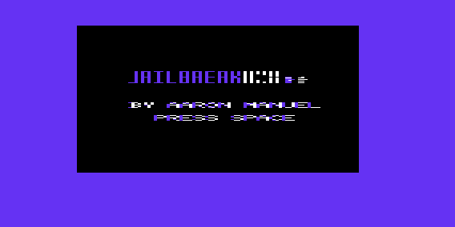
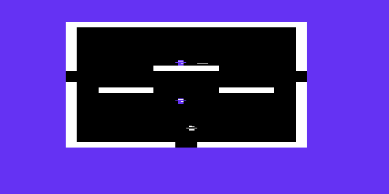

# retrogame-project

> This repository contains files related to a retrogame side project, named "Jailbreak" developed in 6502 assembly for the VIC-20 platform.

Jailbreak is a Berzerk clone where you play as a prisoner attempting to escape from a jail. Work is ongoing.




### Folder structure
The following is the folder structure for this project.
```
./
├───compress
│   ├───rle_gpt
│   └───zx02
├───exp
├───game
├───level_edit
└───misc
```

- `compress` includes a Run Length Encoding algorithm and an LZSS algorithm from https://github.com/einar-saukas/ZX0 to compress the title screen of the game to fit the limited memory of a VIC-20 (3.5KB!).
- `exp` includes test programs meant to incrementally familiarize myself with 6502 assembly language and the VIC-20 environment, from printing out Hello World to testing out game mechanics.
- `game` includes the main `jailbreak.s` source code and accompanying headers for the address space, characters, binary of the compressed title screen, levels, etc.  
- `level_edit` includes a python script adapted from the program developed in `compress/rle_gpt` to create the `levels.h` header file from a text file like `levels.txt`.
- `misc` includes any miscellaneous files or assets like screenshots etc.

### How to Run

#### Running the game

To run the game, you must first assemble the game using the DASM assembler, which should be installed. In the `game` directory, run:
```
dasm jailbreak.s -ojailbreak.prg -lout.lst
```
Then, run `jailbreak.prg` in an emulator such as xvic, part of the VICE emulator suite (https://vice-emu.sourceforge.io/). The prg file will be placed in the `game` folder once the game is finished.

To assemble programs in the `exp` or other folder, replace the `jailbreak.s` and `jailbreak.prg` in the dasm command above with the corresponding source code and .prg filename you wish to assemble, and then run  in an emulator.

#### Running the level editor 

To run the level editor, navigate to `/level_edit`, then change the `levels.txt` file as needed. The first line is the layout of levels from left to right and top to bottom assuming 3 columns max. Then place the name of the level in the next line and edit a 22x23 grid with the following objects
- `x` - impassable wall
- `.` - open space
- `T` - enemy guard
- `0` - gateway/door to another level

Then, run the `level_editor` script to compile the levels.h file by running the following command with the following usage.

```
python level_editor.py <level_file> <output_file>
```
Where `level_file` is the text file with level data and `output_file` is the header file (e.g `levels.h`) you wish to include in the source code as an include according to DASM requirements.
